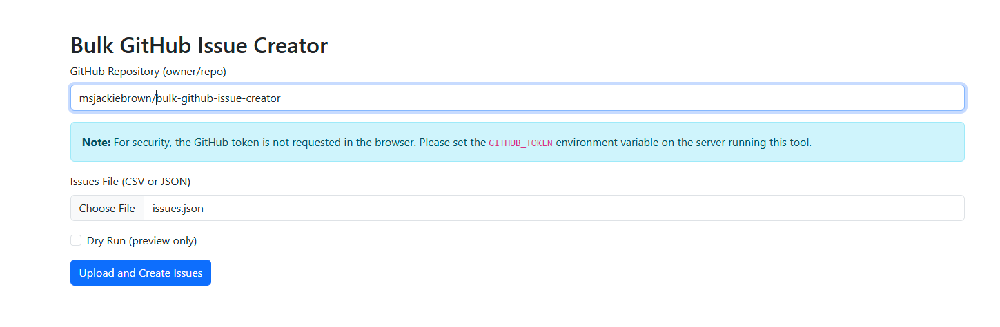
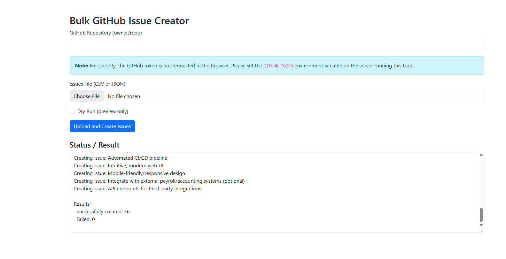

# Bulk GitHub Issue Creator

A command-line tool and secure web UI to create GitHub issues in bulk from JSON or CSV files.

## Features

- Create multiple GitHub issues at once (CLI or Web UI)
- Support for both JSON and CSV input formats
- Specify labels and assignees for each issue (supports both comma-separated strings and arrays in JSON)
- Dry-run mode to preview issues before creation
- Detailed reporting of successful/failed creations
- Secure web UI for uploading files (no token entry in browser; token is read from server environment)
- Robust error handling and logging to `bulk-github-issue-creator.log`

## Web UI Screenshots

Below are screenshots of the secure web interface for uploading your issues file and monitoring results:

| Upload Form | Status/Result Display |
|:-----------:|:--------------------:|
|  |  |

> **Note:** The GitHub token is never entered or visible in the browser. All authentication is handled securely on the server.

## Prerequisites

- Java 21 or higher
- Maven (for building from source)
- GitHub Personal Access Token with appropriate permissions (see below)

## Installation

### Download pre-built JAR

Download the latest release from the [Releases](https://github.com/yourusername/bulk-github-issue-creator/releases) page.

### Build from source

```bash
# Clone and build
 git clone https://github.com/yourusername/bulk-github-issue-creator.git
 cd bulk-github-issue-creator
 mvn clean package
```

This will create a runnable JAR file in the `target` directory.

## Usage

### Command-Line Usage

```bash
java -jar target/bulk-github-issue-creator-2.0.0.jar --repo owner/repository --file issues.json
```

You will be prompted for your GitHub token, or you can set the `GITHUB_TOKEN` environment variable.

### Web UI Usage

1. **Set your GitHub token as an environment variable (for security):**
   - **Windows PowerShell:**
     ```powershell
     $env:GITHUB_TOKEN="your_token_here"
     java -jar target/bulk-github-issue-creator-2.0.0.jar
     ```
   - **Linux/macOS Bash:**
     ```bash
     export GITHUB_TOKEN=your_token_here
     java -jar target/bulk-github-issue-creator-2.0.0.jar
     ```
2. Open your browser and go to [http://localhost:8080/](http://localhost:8080/)
3. Upload your CSV or JSON file and specify the repository.
4. **The token is never sent via the browser for security.**

### Command-line Options

```
Usage: bulk-github-issue-creator [-dh] [--format=<format>] -f=<issuesFile>
                                 -r=<repository> [-t=<token>] [--version]
Creates GitHub issues in bulk from JSON or CSV files
  -d, --dry-run              Perform a dry run without creating actual issues
  -f, --file=<issuesFile>    Path to the JSON or CSV file containing issue data
      --format=<format>      Force file format (json or csv). If not specified,
                               it will be inferred from the file extension.
  -h, --help                 Show this help message and exit.
  -r, --repo=<repository>    GitHub repository in the format 'owner/repo'
  -t, --token=<token>        GitHub personal access token. If not provided, will
                               look for GITHUB_TOKEN environment variable.
      --version              Show version info and exit.
```

## Input File Templates

### JSON Format

```json
[
  {
    "title": "Issue Title",
    "body": "Issue description and details",
    "labels": "label1,label2", // or ["label1", "label2"]
    "assignees": "username1,username2" // or ["username1", "username2"]
  }
]
```

### CSV Format

```csv
title,body,labels,assignees
"Issue Title","Issue description and details","label1,label2","username1,username2"
"Another Issue","Description for another issue","bug",""
```

> **Note:** You can use either comma-separated strings or arrays for `labels`/`assignees` in JSON.

## GitHub Token

Create a Personal Access Token with `repo` scope at [GitHub Personal Access Tokens](https://github.com/settings/tokens).

> **Security Tip:**
> - **Never** put your token in `application.properties` or any file.
> - Always use an environment variable.

## Examples

### Create issues from a JSON file (CLI)

```bash
java -jar target/bulk-github-issue-creator-2.0.0.jar --repo yourusername/your-repository --file issues.json
```

### Perform a dry run (CLI)

```bash
java -jar target/bulk-github-issue-creator-2.0.0.jar --repo yourusername/your-repository --file issues.csv --dry-run
```

### Force file format (CLI)

```bash
java -jar target/bulk-github-issue-creator-2.0.0.jar --repo yourusername/your-repository --file issues.txt --format json
```

## Logging

All actions and errors are logged to `bulk-github-issue-creator.log` in the working directory.

## License

This project is licensed under the MIT License — see the LICENSE file for details.
